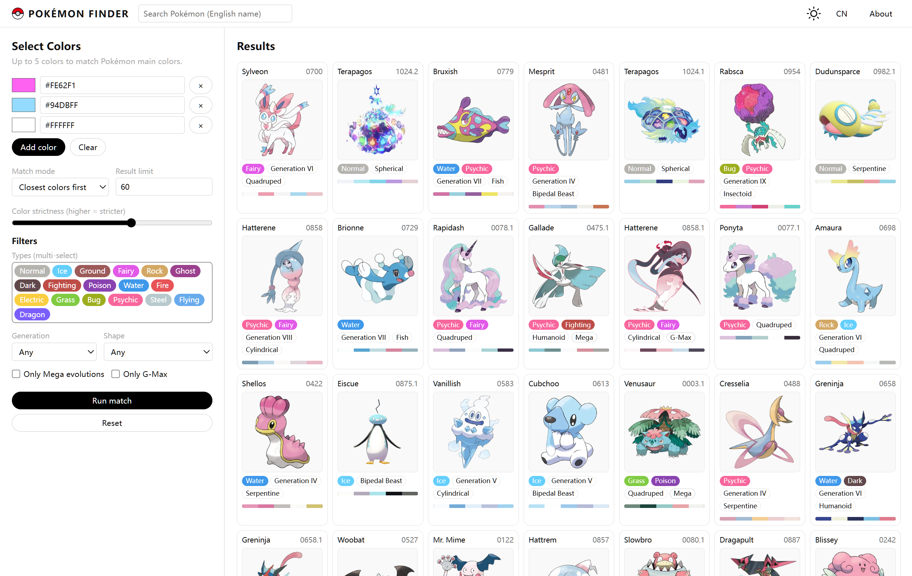

# Pokémon Finder

A small tool that helps you **find a Pokémon by its look** or **see the look of a Pokémon by its name**.

The frontend is a purely static site. No backend service is required and all computation runs locally in your browser.

## Features

- **Appearance → Name: match Pokémon by main colors**
  - Add up to 5 colors via color picker or hex values.
  - Click `Run match` to search the whole sprite set for Pokémon whose palettes best match your selected colors.

- **Name → Appearance: search by name / pinyin**
  - The top search bar supports: Chinese name, English name, pinyin, and pinyin initials.
  - Type a query and press `Enter` to show the first matching Pokémon card on the right.

- **Filtering & display**
  - Filters: types (up to 2), generation, shape, Mega / G‑Max.
  - Display: a card list on the right. You can limit result count; each card shows name, index, types and a strip of main colors.

- **Theme & layout**
  - Supports light / dark theme toggle.
  - On desktop the layout is split left / right; on mobile it automatically switches to a vertical layout and adjusts the number of columns.

## How to use (short)

1. **Match by colors**
   - Click `Add color` and use the color picker or type a hex value.
   - Set your filters, then click `Run match` to see results.

2. **Search by name**
   - Type Chinese / pinyin / initials / English in the top search bar and press `Enter`.
   - The right side will show only the first matching Pokémon. Changing filter controls will switch back to color‑matching mode.

3. **Adjust results**
   - You can tweak match mode, result limit, types / generation / shape / Mega / G‑Max filters; results update automatically.
   - Use `Reset` to restore default settings and clear all colors and filters.

## Data & extension

- Color data comes from preprocessing official Pokémon artwork. Each Pokémon has several representative main colors in hex.
- To swap in another image set or dataset, just keep the `pokemon_data.json` field structure compatible.
- Base Pokémon data in this project is curated and enhanced on top of community datasets. Original data reference: [42arch/pokemon-dataset-zh](https://github.com/42arch/pokemon-dataset-zh).

## License & author

- All Pokémon names and images are copyrighted by their respective rights holders. This project is for personal learning and hobby purposes only.
- Author: @ZTMYO
