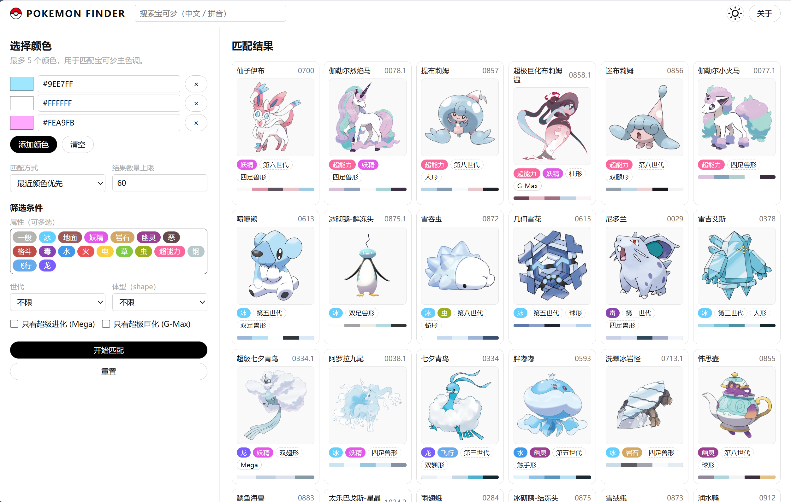

# Pokémon Finder

一个支持“**凭外貌找名字**”和“**凭名字看外貌**”的宝可梦检索小工具。

- 凭外貌：通过主色 / 配色在全图集中找到长相最接近的宝可梦。
- 凭名字：通过名称 / 拼音快速定位宝可梦，并查看其主色与形象。

前端纯静态页面，无需后端服务，所有计算都在浏览器本地完成。

## 功能概览（核心：外貌 <-> 名字 双向检索）

- **按颜色匹配宝可梦主色（外貌 -> 名字）**
  - 左侧支持添加最多 5 个颜色（使用取色器或手动输入十六进制颜色值）。
  - 点击 `开始匹配` 后，根据你给出的颜色组合，从全图像数据中计算最接近的宝可梦。
  - 默认算法会对你输入的每一个颜色分别寻找对应的主色，并综合这些匹配度进行排序，更适合找“整体色调相似”的宝可梦。

- **按名称 / 拼音快速定位宝可梦（名字 -> 外貌）**
  - 顶部 Header 里有一个搜索框，可输入：
    - 中文名（如 “皮卡丘”）、
    - 英文名（如 `Pikachu`）、
    - 拼音（如 `PiKaQiu`，不区分大小写）、
    - 拼音首字母（如 `PKQ`）。
  - 在搜索框中输入后按 `Enter`：
    - 会在右侧结果区域只显示**一张**匹配到的宝可梦卡片（取第一条匹配）。
    - 顶部“匹配结果”右侧会显示 `搜索: xxx` 作为当前搜索提示。
  - 点击左侧任意筛选控件（属性 / 世代 / 体型 / Mega / G‑Max / 匹配方式 / 数量）时：
    - 会自动清空搜索框并回到“按颜色 + 筛选”模式。

- **筛选条件**
  - **属性**：最多可同时选择 2 个属性，使用对应的属性主题色高亮显示。
  - **世代**：选择出现世代。
  - **体型（shape）**：按官方体型分类筛选。
  - **Mega / G-Max**：只看超级进化或只看超极巨化。

- **结果展示**
  - 右侧以卡片形式展示匹配结果，可根据“结果数量上限”控制数量。
  - 每张卡片底部有一条**圆角色卡条**，由若干色块拼接而成，直观展示该宝可梦的主色组成。
  - 卡片顶部显示：中文名、编号、属性、世代、体型、是否 Mega / G‑Max 等。

- **主题与布局**
  - 支持明暗主题切换（右上角图标按钮）。
  - 桌面端为左右两栏布局；移动端以筛选在上、结果在下的方式展示：
    - 宽度较大的手机上一行最多 3 张卡片。
    - 特别窄的屏幕自动降级为 2 列，避免出现水平滚动条。

## 使用说明

1. **选择颜色**
   - 点击 `添加颜色` 增加一行颜色输入。
   - 点击左侧圆形取色器，或在右侧输入框直接填入十六进制颜色（例如 `#FF0000`）。
   - 最多支持 5 个颜色；`清空` 会移除所有颜色行。

2. **按名称 / 拼音快速查找**
   - 在页面顶端的搜索框中输入：
     - 中文名（例：`皮卡丘`），或
     - 拼音（例：`pikaqiu` / `PiKaQiu`），或
     - 拼音首字母（例：`PKQ`），或
     - 英文名的一部分（例：`pika`）。
   - 按下 `Enter`：
     - 在所有宝可梦中查找**名称包含该关键字**或**拼音 / 首字母前缀匹配**的记录；
     - 若找到，右侧只显示第一条匹配的宝可梦卡片；
     - 若找不到，则在右侧显示“没有找到匹配的宝可梦，请尝试其他名称或拼音。”
   - 该搜索模式仅用于“我记得名字但忘了长相”的场景，不参与颜色匹配计算。

3. **设置匹配方式**
   - `最近颜色优先`（默认）：对你输入的每个颜色，分别在宝可梦主色中找最近的颜色，并累加这些距离，总距离越小排名越靠前，更适合“多色搭配”场景。
   - `与平均色接近`：将你输入的颜色平均后，与每只宝可梦主色的平均色比较，更像是“整体滤镜颜色”匹配。
   - `任一颜色匹配`：只要宝可梦主色中有某个颜色非常接近你输入的任一颜色，就可能排在前面，更适合“我要找接近这个单色的所有宝可梦”。

4. **调整筛选条件**
   - 在“筛选条件”区域中可以随时勾选 / 取消属性、世代、体型、Mega / G‑Max 等。
   - 除颜色外的所有控件（匹配方式、结果数量、各种筛选）变化时都会**自动刷新右侧结果**。

5. **执行匹配 / 重置**
   - 颜色修改后，需要点击左下角 `开始匹配` 按钮，才会根据当前颜色和筛选重新计算匹配结果。
   - `重置` 按钮会：
     - 清空所有颜色行；
     - 恢复匹配方式为 `最近颜色优先`，结果数量为 `60`；
     - 清空所有筛选（属性、世代、体型、Mega / G‑Max）。

## 数据与扩展

- 颜色数据来源于对宝可梦官方图像的预处理，每只宝可梦的 `colors` 字段为若干代表主色的十六进制值。
- 如需替换为其他图片或数据源，只要保持 `pokemon_data.json` 字段结构一致即可继续使用现有前端。
- 宝可梦基础数据在此项目中做了二次整理与增强，原始数据参考自仓库：[42arch/pokemon-dataset-zh](https://github.com/42arch/pokemon-dataset-zh)。

## 许可与作者

- 前端代码：请根据你自己的项目需要选择合适的开源协议。
- 宝可梦相关的名称与图像版权归原权利方所有，本项目仅用于个人学习与爱好展示。
- 作者：@ZTMYO
